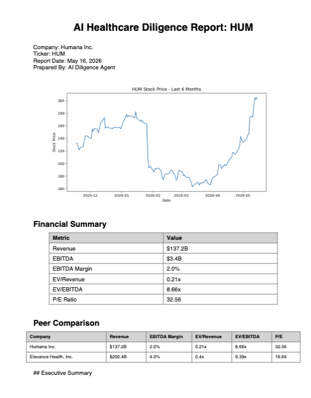

# AI Healthcare Diligence Agent

An AI-powered healthcare diligence and investment research pipeline built with Python, SEC EDGAR filings, local LLM inference, and financial market data.

This project automates the generation of institutional-style healthcare diligence reports by combining:
- public market financial data
- SEC 10-K filings
- peer benchmarking
- stock performance analytics
- AI-generated investment analysis
- automated PDF report generation

## Sample Report Output


---

# Features

- Pulls public company financial data using Yahoo Finance
- Downloads real SEC 10-K filings from EDGAR
- Extracts SEC risk factor disclosures
- Calculates valuation and financial metrics
- Generates peer comparison analysis
- Creates stock price charts automatically
- Produces AI-generated diligence reports
- Exports polished PDF reports with charts and tables

---

# Example Workflow

Ticker Input → Financial Data → SEC Filing Download → Risk Factor Extraction → AI Analysis → Chart Generation → PDF Diligence Report

---

# Technologies Used

- Python
- Ollama
- Llama 3.2
- yfinance
- sec-edgar-downloader
- matplotlib
- reportlab
- VS Code

---

# Sample Output

The system generates:
- Executive summaries
- Financial analysis
- Peer benchmarking
- Stock performance commentary
- Risk analysis
- Diligence questions
- PDF investment-style reports

---

# Example Report Sections

- Executive Summary
- Company Overview
- Financial Summary
- Peer Comparison
- Stock Performance Commentary
- Competitive Positioning
- Key Risks
- Diligence Questions

---

# Future Improvements

- Real-time healthcare news integration
- Multi-company batch report generation
- Relative peer stock performance analysis
- Interactive dashboard/web interface
- Advanced valuation modeling
- Automated acquisition target scoring
- Improved PDF formatting and styling

---

# Installation

```bash
pip install yfinance matplotlib reportlab sec-edgar-downloader requests